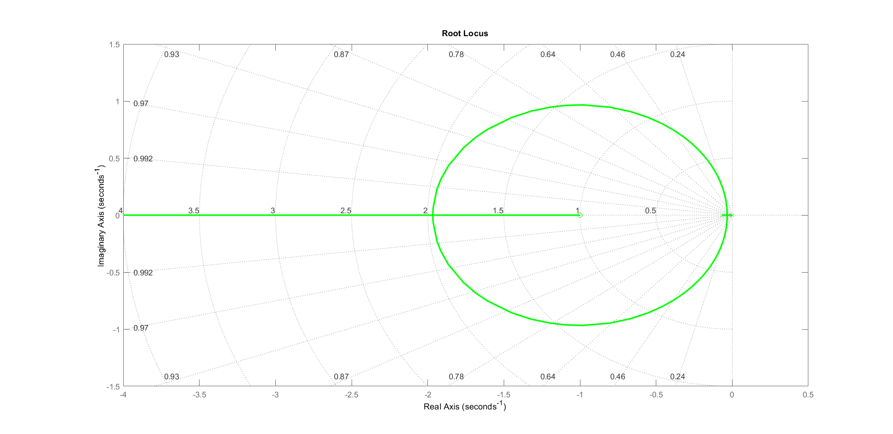

## **Sistema não Linear: Nível de Tanque**
A dinâmica de entrada de tensão no motor até a vazão de saída é um sistema que pode ser modelado como uma simples relação de proporcionalidade, sendo assim

$$
    F_{in} = K_m V_p
$$

A constante $K_m$ será determinada experimentalmente a partir de medições de tempo realizadas na planta, procedimento descrito na seção de metodologia.

\subsection{Modelagem Matemática do Nível do Tanque}
O modelo do sistema considerando apenas um tanque pode ser modelado de acordo com a equação da conservação da massa para um volume de controle, dada por

$$
    \frac{dm}{dt}_{sis} = \frac{\partial}{\partial t} \int_{VC} \rho d \forall + \int_{SC} \rho \vec{v} \cdot d\vec{A} = 0
$$

assumindo densidade e área de seção transversal constante e duas superfícies de controle (Entrada superior e saída inferior), a equação 2 se reduz à

$$
    \frac{d}{d t} \rho \forall =  \rho {v}_1 A_1 - \rho {v}_2 A_2
$$

Considerando que a área da seção transversal cilíndrica constante, o volume é dado por

$$
    \forall = A  \cdot L_1
$$

então

$$
    \frac{d}{d t} \rho L_1 A = F_{in} - F_{out} = \rho {v}_1 A_1 - \rho {v}_2 A_2
$$

Considerando a densidade constante, e velocidade de saída dada pelo teorema de Torricelli

$$
    v_2 = \sqrt{2 g L_1} = \sqrt{2g} \sqrt{L_1}
$$

A equação diferencial é dada finalmente por

$$
    \frac{d L_1}{dt} = \frac{F_{in}}{A} - \frac{A_2}{A} \sqrt{2g}\sqrt{L_1}
$$

A equação acima é claramente não linear, e para podermos aplicar a modelagem de laplace e achar a função de transferência do sistema, é preciso lineariza-lo primeiro.
Para isso, podemos usar a expansão em série de Taylor em torno de um ponto de operação $L_0$, onde a função é dada por $\sqrt{L_1} = \sqrt{L_0} +\frac{1}{2\sqrt{L_0}}(L_1-L_0) $, podemos então usar variáveis de desvio \cite{nise2017} e assumir

$$
    \begin{cases}
    L_1 = L_0 +  \tilde{L}_1 \\
    \sqrt{L_0 +  \tilde{L}_1} = \sqrt{L_0} +\frac{1}{2\sqrt{L_0}}(L_0 +  \tilde{L}_1-L_0) = \sqrt{L_0} +  \frac{1}{2\sqrt{L_0}}\tilde{L}_1\\
    F_{in} = F_{0} + \tilde{F}_{in}
    \end{cases}
$$

assim, a equação diferencial se torna

$$
        \frac{d (L_0 +  \tilde{L}_1)}{dt} = \frac{F_{0} + \tilde{F}_{in}}{A} - \frac{A_2}{A} \sqrt{2g}( \sqrt{L_0} + \frac{1}{2\sqrt{L_0}}\tilde{L}_1)
$$

Considerando um ponto de operação onde

$$
    \frac{F_{0}}{A} = \frac{A_2}{A} \sqrt{2g}\sqrt{L_0}
$$

Temos

$$
    \frac{d \tilde{L}_1}{dt} = \frac{\tilde{F}_{in}}{A} - \frac{A_2}{A} \sqrt{2g} \frac{1}{2\sqrt{L_0}}\tilde{L}_1
$$

podemos agora nomear constantes e chegar na seguinte equação

$$
     \frac{d {L}_1}{dt} = -\alpha {L}_1 + \beta F_{in}
$$

onde

$$
\begin{cases}
\alpha =   \frac{A_2}{A} \sqrt{\frac{g}{2L_0}} \\
\beta = \frac{1}{A}
\end{cases}
$$  

Aplicando a transformada de laplace na equação acima, temos:

$$
    s L_1(s) = -\alpha L_1(s) + \beta F_{in}(s)
$$

Podemos finalmente obter a função de transferência do sistema, Assumindo um modelo constante entre a vazão da bomba e sua tensão $F_{in}(s) = K_m V_p(s)$, finalmente temos

$$
    s L_1(s) + \alpha L_1(s)  = \beta K_m V_p(s)
$$

então

$$
    G(s) = \frac{L_1(s)}{V_p(s)} = \frac{\beta K_m}{s + \alpha}
$$

Que é uma função de transferência de primeira ordem, com polo no semi-plano complexo esquerdo, por isso é sempre estável, com ganho $\beta K_m$.

Considerando os valores especificados pela planta pelo professor,

$$
\begin{cases}
    L_0 = 15 \text{ cm} \  \text{(ponto de operação)}\\
    d_1 = 4,445 \text{ cm (diâmetro do tanque)} \\
    d_2 = 0,47625 \text{ cm (diâmetro do orifício de saída)} \\
    A_1 = 15,51 \text{ cm}^2 \text{ (área da base do tanque)} \\
    a_1 = 0,178 \text{ cm}^2 \text{ (área do orifício de saída)} \\
    g = 980 \text{ cm/s}^2 \text{ (aceleração da gravidade)}
\end{cases}
$$

assim temos

$$
\begin{cases}
    \alpha = 0.066 \\
    \beta K_m = 0.26
\end{cases}
$$

Então a função de transferência de primeira ordem é dada por

$$
    G(s) = \frac{L_1(s)}{V_p(s)} = \frac{0.26}{s + 0.066}
$$

## **Controlando o nível do tanque: Controle de Sistema de Primeira ordem**

Considerando a função de transferência linearizada em torno do ponto de operação

$$
    G(s) = \frac{L_1(s)}{V_p(s)} = \frac{0.26}{s + 0.066} = \frac{A}{s + \tau}
$$

E a função de transferência do controlador PID

$$
  C(s) = \frac{K_d s^2 + K_p s + K_I}{s}
$$

assim, a função de transferência de malha fechada com o controlador se torna

$$
G_{mf}(s) = \frac{ G(s) C(s)}{1 + G(s) C(s)} = \frac{ \frac{A(s^2 K_d + s K_p + K_I)}{s(s+\tau)} } {1  + \frac{A(s^2 K_d + s K_p + K_I)}{s(s+\tau)}}   = \frac{ \frac{1}{AK_d+1}(s^2 + K_p/K_ds + K_I/K_d)}{s^2 + \frac{(AK_p + \tau)}{AK_d+1}s + \frac{AK_I}{AK_d + 1} }
$$

considerando apenas um controlador PI, fazendo $K_d \rightarrow 0$, temos

$$
G_{mf}(s) = \frac{AK_p s + AK_I}{s^2 + (AK_p + \tau)s + AK_I}
$$

Podemos agora utilizar o LGR para calcular o ganho K, então assim temos

Passo 1 e 2:

$$
1 + G(s)H(s) = 1 + \frac{A}{s + \tau} \frac{K_ps + K_I}{s} = 1 + K_p\frac{A(s + \tau_i)}{s(s+\tau)}
$$

Agora os passos do LGR definem

Passo 3: Os lugares a esquerda de um numero impar de polos+zeros é LGR

Passo 4: Polos: 0, $\tau$, Zeros: $\tau_i$

Passo 5: $LS = max(N_p, N_z) = N_p = 2$

Passo 6: Simetria

Passo 7: $N_p - N_z = 2 - 1 = 1$ Polos seguem assíntotas em direção ao infinito

Passo 8: Os pontos de saída podem ser encontrados de acordo com as raízes válidas da equação

$$
\frac{d}{ds} \frac{1}{P(s)} = 0
$$

Passo 9: Os cruzamentos no eixo imaginário são dados pelo método de Routh Hurwitz

Passo 10: Não existem ângulos de saída porque não existem polos complexos.

O LGR é enfim mostrado abaixo

